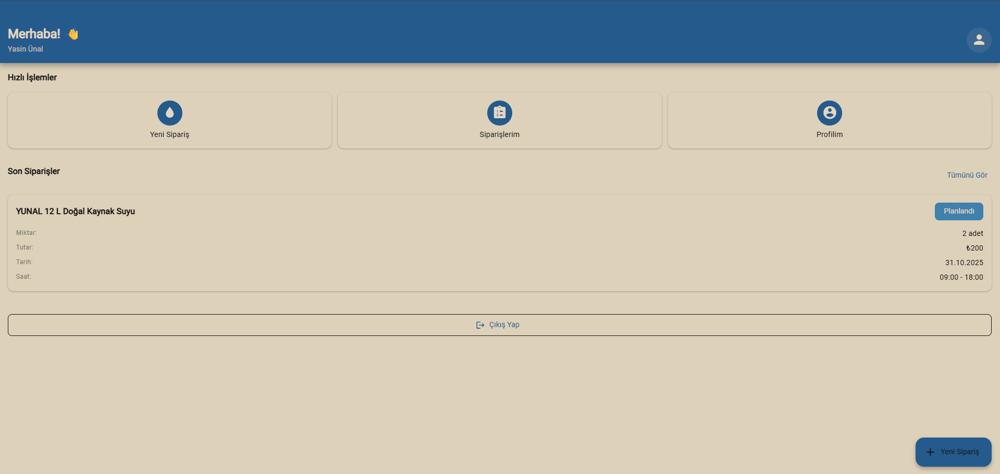
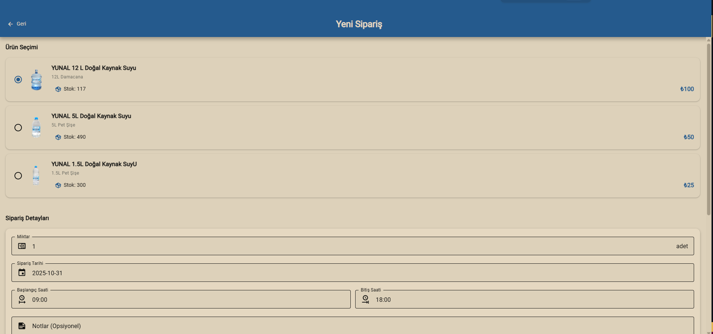
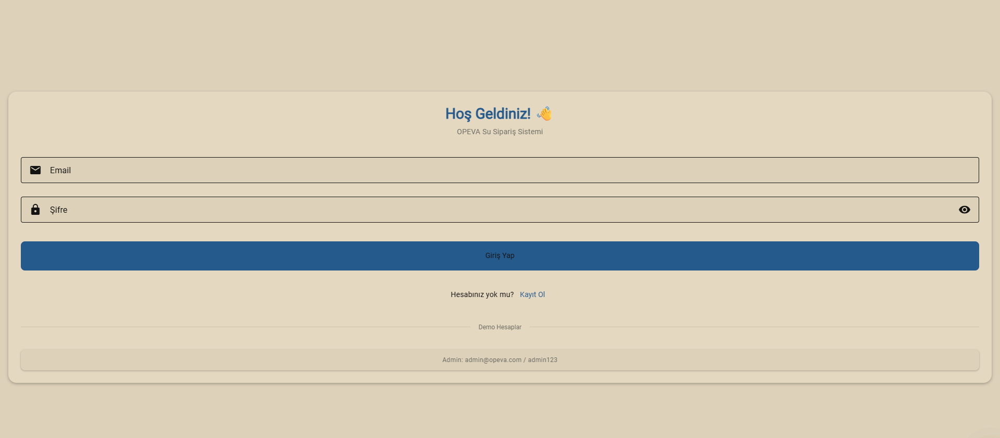

# Opeva-Su Mobile Uygulaması

Bu uygulama, kullanıcı tarafında su sipariş yönetimi işlemlerini gerçekleştiren bir mobil uygulamadır. Kullanıcılar, sisteme kayıt olabilirler, su siparişlerini oluşturabilir, mevcut siparişlerini görüntüleyebilir ve sipariş geçmişlerini inceleyebilirler.

## Sonraki Adımlar 

Bunlar eklenebilir:
- [ ] Dosya/klasör yapısı iyileştirmeleri
- [ ] Kullanıcı profili yönetimi (şifre değiştirme, iletişim bilgileri güncelleme vb.)
- [ ] Admin paneli entegrasyonu (tüm siparişlerin yönetimi, tüm kullanıcıların yönetimi vb.)
- [ ] Sipariş iptal etme özelliği
- [ ] Push bildirimleri ile sipariş durumu güncellemeleri
- [ ] Çoklu dil desteği
- [ ] Sipariş formunda ürün görselleri ekleme ve ürün açıklamaları
- [ ] Ürün detayları inceleme
- [ ] Sipariş tarihi düzeltmeleri
- [ ] Arayüz düzenlemeleri ve iyileştirmeleri
- [ ] Performans optimizasyonları

### Uygulama içinden görseller 

  
  
  

